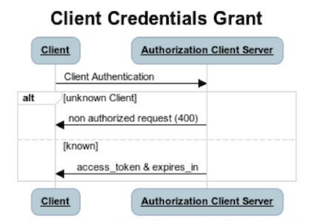

# BlaBlaCar API Documentation

**⚠️ Important notes:** 
- For all API endpoints, specify `application/json` as `Content-Type` header.
- We use Datadome to detect bots. You may experience 403 errors with `x-datadome-*` response headers when you hit the API from cURL in your terminal. Use tools like Postman or hit the API using URLSession to prevent this blocking issue.

<!-- 
	Table Of Contents generated using MarkdownTOC plugin with Sublime Text 3 (https://github.com/naokazuterada/MarkdownTOC#usage)
-->

<!-- MarkdownTOC levels="1,2,3" autolink="true" autoanchor="true" -->

- [Authentication](#authentication)
	- [OAuth2's Authentication \(Getting an Access Token\)](#oauth2s-authentication-getting-an-access-token)
	- [Request an access token](#request-an-access-token)
- [Web Services](#web-services)
	- [Trip Search](#trip-search)

<!-- /MarkdownTOC -->


<a id="authentication"></a>
## Authentication

<a id="oauth2s-authentication-getting-an-access-token"></a>
### OAuth2's Authentication (Getting an Access Token)

#### GET|POST Client Credentials Grant (refs)

Clients can request an access token using credentials:



1. The client authenticates with the authorization server and requests an access token from the
token endpoint.
1. The authorization server authenticates the client, and if valid issues an access token.

<a id="request-an-access-token"></a>
### Request an access token

#### URL
POST | https://edge.blablacar.com/token

#### DESCRIPTION
Authorize a client application to the Edge Service (also known as public token).

#### INPUT PARAMETERS

| Parameter | Type 	| Description 	| Optional 	|
| ---		| ---	| ---			| ---		| 
| grant_type | String | Grant type used for authentication | false |
| client_id | String | Client ID | false |
| client_secret | String | Client Secret | false |
| scopes | Array(String) | Authorization scopes | true |

#### CURL EXAMPLE

```
curl --location --request POST 'https://edge.blablacar.com/token' \
--header 'Content-Type: application/json' \
--data-raw '{
    "grant_type": "client_credentials",
    "client_id": "ios-technical-tests",
    "client_secret": "rVSUYoebg6zbZxYNxGOGAxv09oSi3gGg",
    "scopes": [
        "SCOPE_TRIP_DRIVER",
        "DEFAULT",
        "SCOPE_INTERNAL_CLIENT"
    ]
}'
```

#### OUTPUT EXAMPLE

```
{
    "access_token": "bda22672-60c9-4403-b533-3840c19ba5a8",
    "token_type": "bearer",
    "issued_at": 1592905065,
    "expires_in": 600,
    "client_id": "ios-technical-tests",
    "scopes": [
        "SCOPE_TRIP_DRIVER",
        "DEFAULT",
        "SCOPE_INTERNAL_CLIENT"
    ]
}
```

#### STATUS CODES

| CODE | USAGE | 
| --- | --- |
| 200 | Authentication succeeded |
| 400 | - Invalid request <br> - Client has been deprecated <br> - Client ID or secret is invalid <br> - Client is not allowed to use client_credentials grant type |

<a id="web-services"></a>
## Web Services

<a id="trip-search"></a>
### Trip Search

Search for carpool and buses rides given a departure, arrival and date.

#### URL
GET | https://edge.blablacar.com/trip/search

#### DESCRIPTION
The Trip service returns a list of rides matching given criteria such as departure date, number of seats, and various sort and filter options. The minimal set of required parameters is departure and arrival places.

The API accepts 2 formats of places:

* **Without coordinates**<br><br>
When the locations are imprecise, only the address is passed and the Trip service performs a reverse geocode action to get the correct location. SEO search results are based on that: "www.blablacar.fr/ride-sharing/paris/lyon/"<br><br>
`from_address` OR `to_address` are **required**

* **With coordinates**<br><br>
When we have identified a precise-enough location, we have access to its coordinates and they can be passed to the request along with the country code.<br><br>
`from_coordinates` AND `to_coordinates` are **required**<br>
`from_country` AND `to_country` are **required**

#### INPUT PARAMETERS

| Parameter | Type 	| Description 	| Optional 	|
| ---		| ---	| ---			| ---		|
| from_address | String | Departure address | false |
| to_address | String | Arrival address | false |
| from_coordinates | String | Departure coordinates in the lat,lng form (eg. 48.756,7.268) | false |
| to_coordinates | String | Arrival coordinates in the lat,lng form (eg. 48.756,7.268) | false |
| from_country | String | Departure ISO-3166 country code (2 letters, eg. FR) | false |
| to_country | String | Arrival ISO-3166 country code (2 letters, eg. FR) | false |
| search_uuid | String | Unique identifier for this search (UUID) | false |
| departure_date | String | Departure day in the form YYYY-MM-DD | true |
| min_departure_time | String | Minimum time of departure in the form HH:mm:ss | true |
| requested_seats | Integer | Number of seats to book | true |
| from_cursor | String | Cursor to paginate (backend driven value retrieved from pagination object in response) | true |
| transport_type | String | Enum: `carpooling` \| `bus`<br><br>Filter for bus or carpooling results only. If null, all results are fetched. | true |
| sort | String | Enum: `PRICE:ASC` \| `PRICE:DESC` \| `DEPARTURE_DATETIME:ASC` \| `DEPARTURE_DATETIME:DESC`<br><br>Type of sorting used | true |

#### INPUT HEADERS

| Key | Description |
| --- | --- |
| Authorization | Bearer authentication using access token retrieved from authentication endpoint<br>Example: `Bearer XXXXX-XXXXX-XXXXX` |
| X-Locale | Language and region identifiers<br>Examples: `fr_FR`, `en_GB`, `pt_BR` |
| X-Visitor-Id | Device UUID<br>Example: `8401658C-E98D-457E-A087-34FA2D979D69` |
| X-Currency | ISO-4217 currency code for prices<br>Examples: `EUR`, `GBP` |
| X-Client | Client identifier and version, separated by `\|`<br>Example: `iOS\|1.0.0` |

#### CURL EXAMPLE

```
curl --location --request GET 'https://edge.blablacar.com/trip/search?from_address=Paris&to_address=Toulouse&search_uuid=8401658C-E98D-457E-A087-34FA2D979D69' \
--header 'Authorization: Bearer xxxxx-yyyyy-zzzzz' \
--header 'X-Locale: fr_FR' \
--header 'X-Visitor-Id: 8401658C-E98D-457E-A087-34FA2D979D69' \
--header 'X-Currency: EUR' \
--header 'X-Client: iOS|1.0.0'
```

#### OUTPUT EXAMPLE

```
{
    "full_trips_count": 8,
    "total_trip_count_to_display": 26,
    "trips": [ // list of results
        {
            "multimodal_id": {
                "source": "CARPOOLING",
                "id": "1991466541-massy-rennes"
            },
            "waypoints": [
                {
                    "main_text": "Massy",
                    "place": { // place details },
                    "extra_distance": { // proximity information },
                    "date_time": "2020-06-24T01:30:00+02:00",
                    "type": [
                        "TRIP_DEPARTURE",
                        "PICKUP"
                    ]
                },
                {
                    "main_text": "Rennes",
                    "place": { // place details },
                    "extra_distance": { // proximity information },
                    "date_time": "2020-06-24T04:50:00+02:00",
                    "type": [
                        "TRIP_ARRIVAL",
                        "DROPOFF"
                    ]
                }
            ],
            "monetization_price": {
                "monetized_price": { // price with booking fees applied },
                "not_monetized_price": { // price without fees }
            },
            "driver": { // driver details },
            "flags": [],
            "highlights": []
        },
        { // ... additional results ... }
    ],
    "top_trips": [ // highlighted trips ],
    "pagination": {
        "next_cursor": "cGFnZT0x"
    }
}
```

#### STATUS CODES

| CODE | USAGE |
| --- | --- |
| 200 | Request succeeded
| 400 | Invalid request |
| 401 | Authorization information is missing or invalid (e.g. token invalidated, missing or expired) |
